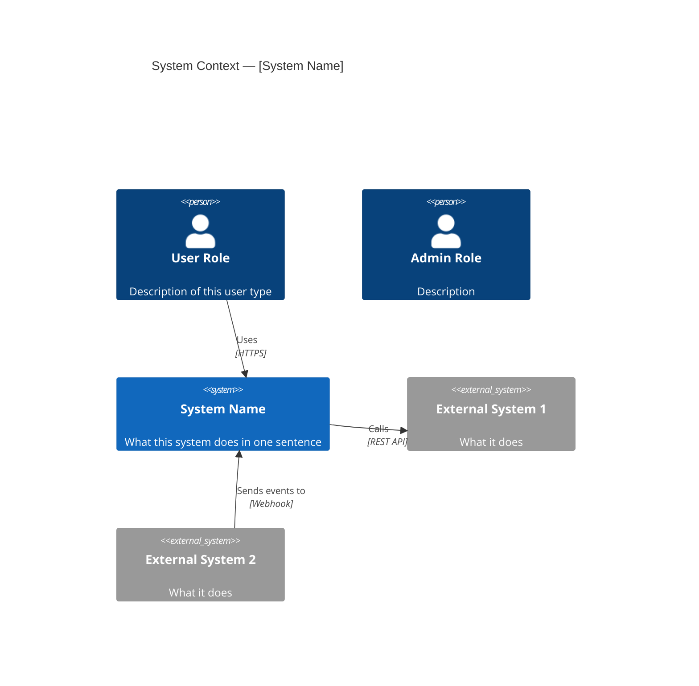
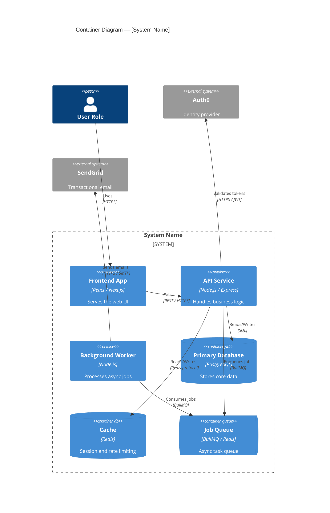
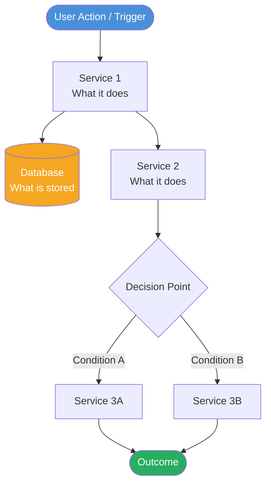
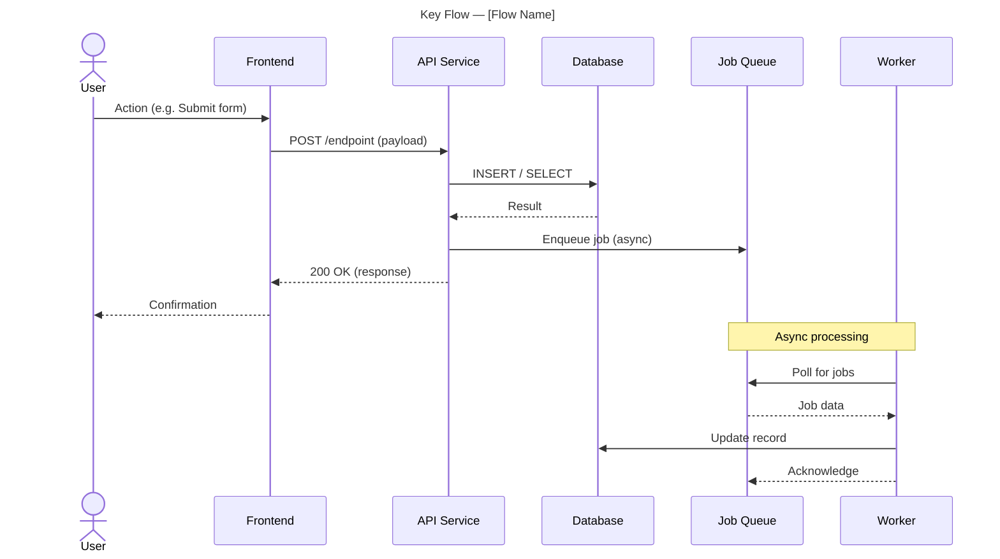
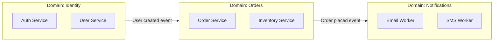

# ArchKit — Diagram Specifications
> Reference for Claude when generating architecture diagrams

All diagrams use Mermaid syntax. Each diagram must be written as an inline ` ```mermaid ` fenced code block inside a `.md` file.

**GitHub renders Mermaid natively in `.md` files.** Do NOT create separate `.mmd` files — they are not rendered by GitHub. All diagrams go into `docs/architecture/DIAGRAMS.md` as inline blocks.

---

## Table of Contents

- [Diagram 1 — C4 Context Diagram](#diagram-1--c4-context-diagram)
- [Diagram 2 — C4 Container Diagram](#diagram-2--c4-container-diagram)
- [Diagram 3 — Data Flow Diagram](#diagram-3--data-flow-diagram)
- [Diagram 4 — Sequence Diagram](#diagram-4--sequence-diagram)
- [Optional Diagram 5 — Domain / Bounded Context Map](#optional-diagram-5--domain--bounded-context-map)
- [Diagram Validation Checklist](#diagram-validation-checklist)
- [Diagram Confidence Labels](#diagram-confidence-labels)

---

## Diagram 1 — C4 Context Diagram

**Purpose:** Shows the system as a black box and all external actors that interact with it. The highest-level view.

**When to use:** Always. This is the first diagram in every architecture doc.

**What to include:**
- The system itself (one box)
- External users / roles that interact with it
- External systems it calls or receives calls from
- Clear labels on all relationships

**Template:**


**Rules:**
- Keep relationship labels short (verb phrase)
- Note the protocol on every relationship
- Do not put internal services in this diagram — only the system boundary and external actors

---

## Diagram 2 — C4 Container Diagram

**Purpose:** Opens up the system boundary and shows all services/containers and how they connect.

**When to use:** Always. This is the main "how it works" diagram.

**What to include:**
- Every service identified in the Service Map
- Databases and data stores
- Message queues and event buses
- API gateways and load balancers
- All communication lines between them
- External systems that services connect to directly

**Template:**


**Rules:**
- Every service from the Service Map must appear here
- Show the technology stack on each container
- Show every communication line — do not omit connections because the diagram gets busy
- Group related services inside a boundary if it helps readability

---

## Diagram 3 — Data Flow Diagram

**Purpose:** Shows how data moves through the system for a specific scenario — typically the primary use case or most complex flow.

**When to use:** Always. Pick the most important data flow in the system.

**What to include:**
- The trigger (user action or external event)
- Every service that touches the data
- What happens at each step
- Where data is stored or transformed
- The final outcome

**Template:**


**Rules:**
- Title the diagram with the specific scenario name (e.g. "Data Flow — User Registration")
- Label every edge with what is being passed (data name, event name)
- Use colour coding: blue = trigger/actor, green = outcome, orange = storage
- Keep it to one scenario — create multiple diagrams if needed

---

## Diagram 4 — Sequence Diagram

**Purpose:** Shows the time-ordered interactions between services for one key flow.

**When to use:** Always. Pick one critical end-to-end flow — typically the most important feature or the most architecturally complex.

**What to include:**
- All participants (services, databases, external systems)
- Every message exchanged in sequence
- Return values / responses
- Async calls clearly marked
- Error paths if significant

**Template:**


**Rules:**
- Use `->>` for calls and `-->>` for responses
- Use `Note over` to annotate important boundaries (e.g. async, external, cached)
- Do not include every single DB query — show the logical steps
- If a call is fire-and-forget, show it but don't show a return arrow

---

## Optional Diagram 5 — Domain / Bounded Context Map

**Use this when:** The system has clear domain boundaries or uses DDD patterns.

**What to include:**
- Each domain / bounded context as a box
- Relationships between domains (upstream/downstream, shared kernel, anti-corruption layer)
- Which services belong to which domain

**Template:**


---

## Diagram Validation Checklist

Before submitting diagrams, verify:

- [ ] All diagrams use valid Mermaid syntax (no broken blocks)
- [ ] Every service from the Service Map appears in the Container Diagram
- [ ] All relationships in the Communication Map appear in at least one diagram
- [ ] All external dependencies appear in the Context Diagram
- [ ] Each diagram has a title
- [ ] Each diagram has a 2–3 sentence explanation below it
- [ ] No made-up services or connections — everything is evidenced in the code

---

## Diagram Confidence Labels

Add a confidence note below each diagram:

```
> **Diagram confidence:** HIGH — all connections directly observed in code
```

or

```
> **Diagram confidence:** MEDIUM — service boundaries confirmed, some connection details inferred
```
